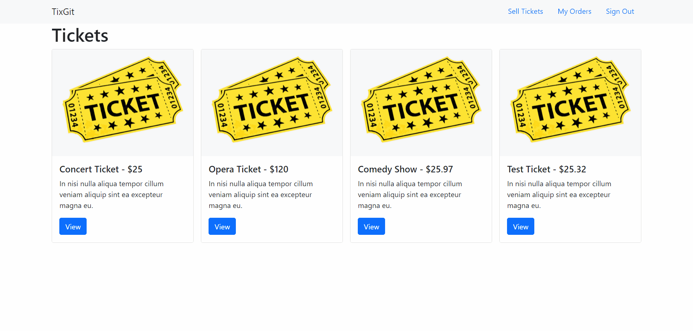

# TixGit 
 

## Description
- Scalable microservice app that allows users to sign up to view and purchase event tickets using Stripe API. Utilizes NATS Streaming Server to communicate between services.
- Runs in Docker containers that are executed in a Kubernetes cluster. Hosted on Azure at [tixgit.website](http://www.tixgit.website)
- Back end is built using Express, Node.js, and TypeScript. Front end utilizes React, Next.js, and Bootstrap.
- MongoDB for all Express services, Redis utilized for expiration service.
- Features JWT based authentication, CI/CD using Github and Jest.

## Getting Started
### Prerequisites

Requirements for the software and other tools to build, test and push 
- [Kubernetes/kubectl](https://kubernetes.io/releases/download/)
- [Docker](https://www.docker.com/products/docker-desktop)
- [Skaffold](https://skaffold.dev/docs/install/)

### Installing

To build a copy of the application locally, first clone or fork the repo, navigate into project directory, and run
    
	npm install
	
Next, save required secrets locally using kubectl [create-secret](https://kubernetes.io/docs/tasks/configmap-secret/managing-secret-using-kubectl/) while Kubenetes is running, replacing [YOUR_KEY] with respective values. You will require a Stripe developer account. More info can be found here at [stripe.com](https://stripe.com/docs).

    kubectl create secret generic jwt-key --from-literal=JWT_KEY=YOUR_JWT_KEY
	kubectl create secret generic stripe-key --from-literal=STRIPE_KEY=YOUR_STRIPE_KEY
	kubectl create secret generic stripe-public-key --from-literal=NEXT_PUBLIC_STRIPE_TEST_PUBLISHABLE_KEY=YOUR_STRIPE_PUBLISHABLE_KEY

Once secrets have been set, while inside project directory, initalize skaffold to commence building the application. 

    skaffold dev

To access to project locally, add the following line to your [hosts](https://www.howtogeek.com/howto/27350/beginner-geek-how-to-edit-your-hosts-file/) file 

	127.0.0.1 ticketing.dev

After that, you should be able to access the project locally at ticketing.dev.

## Authors

  - **Chris Keller** -
    [ckeller22](https://github.com/ckeller22)

## License

The MIT License (MIT)

Copyright (c) 2021 Chris Keller

Permission is hereby granted, free of charge, to any person obtaining a copy of this software and associated documentation files (the "Software"), to deal in the Software without restriction, including without limitation the rights to use, copy, modify, merge, publish, distribute, sublicense, and/or sell copies of the Software, and to permit persons to whom the Software is furnished to do so, subject to the following conditions:

The above copyright notice and this permission notice shall be included in all copies or substantial portions of the Software.

THE SOFTWARE IS PROVIDED "AS IS", WITHOUT WARRANTY OF ANY KIND, EXPRESS OR IMPLIED, INCLUDING BUT NOT LIMITED TO THE WARRANTIES OF MERCHANTABILITY, FITNESS FOR A PARTICULAR PURPOSE AND NONINFRINGEMENT. IN NO EVENT SHALL THE AUTHORS OR COPYRIGHT HOLDERS BE LIABLE FOR ANY CLAIM, DAMAGES OR OTHER LIABILITY, WHETHER IN AN ACTION OF CONTRACT, TORT OR OTHERWISE, ARISING FROM, OUT OF OR IN CONNECTION WITH THE SOFTWARE OR THE USE OR OTHER DEALINGS IN THE SOFTWARE.
